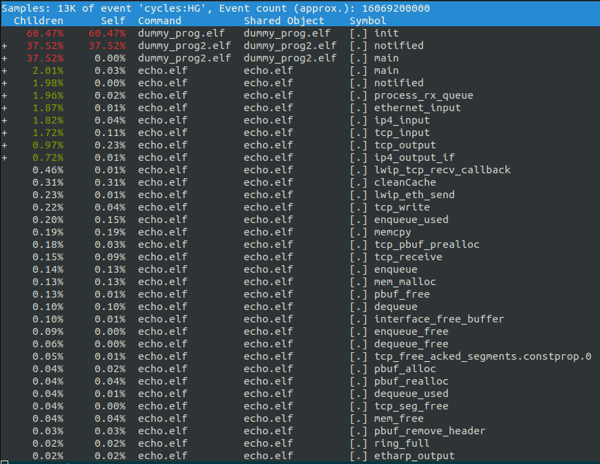
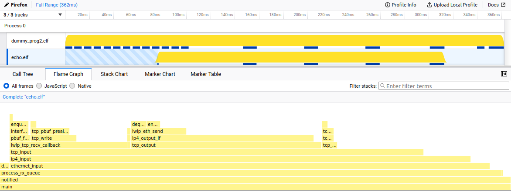

# Example profiling system

This system includes a TCP echo server, as well as two background dummy programs.

## Building

```sh
make MICROKIT_SDK=<path/to/sdk> MICROKIT_BOARD=(maaxboard/odroidc4)
```

## Running

In your `build` directory will be a `loader.img` file that has been created by the Microkit tool.
You will need to load this image on to your board.

## Using netconn
If you have configured the client to use the `netconn` tool for control, you will get something similar to the following
outputted to your terminal:

```sh
Profiler intialising...
MON|INFO: PD '' is now passive!
uart: elf PD init function running
initialising lwip
ARP|NOTICE: client1 registering ip address: 172.16.1.217 with MAC: 52:54:01:00:00:06
LWIP|NOTICE: DHCP request for client1 returned IP address: 172.16.1.217
ARP|NOTICE: client0 registering ip address: 172.16.1.218 with MAC: 52:54:01:00:00:05
LWIP|NOTICE: DHCP request for prof_client returned IP address: 172.16.1.218
```
To connect the `netconn` tool, we will use the IP address that has been assigned to the prof_client. 
In the above case, this is `172.16.1.218`, but will most likely be different when you run this yourself.

The port that we will connect to is `1236`. This is an example of connecting the `netconn` tool for the above
address:

```sh
python3 netconn.py --ip 172.16.1.218 --port 1236
```

You will get the following output from `netconn`:

```sh
netconn. Please enter command:
```

If you enter `connect` into the `netconn` tool, you will connect to the profiler client running on the target board. 
You should see a confirmation of the connection from the profiler client the following outputted from `netconn`:
```sh
100 SEL4 PROFILING CLIENT

echo.elf: 52
dummy_prog.elf: 1
dummy_prog2.elf: 2
```

If you then enter `start` into the netconn tool, this will start recording samples. 
 
If you wish to pause, please enter `stop`, or if you wish to finish profiling, please enter `exit`.

You can also attach an ipbench client to the IP address for `client1`.

Once you have entered `exit`, the `netconn` tool will exit, and a `samples.json` file will
 be left in
your `netconn` directory. This JSON file contains all the sample data, as well as the ELF mappings. 

## Using serial connection

If you have configured your client to use serial control, you will get the following
output once you
have loaded your image: 

```sh
Profiler intialising...
MON|INFO: PD '' is now passive!
uart: elf PD init function running
ARP|NOTICE: client1 registering ip address: 172.16.1.217 with MAC: 52:54:01:00:00:06
LWIP|NOTICE: DHCP request for client1 returned IP address: 172.16.1.217
```
In comparison to the `netconn` configuration, you will only be given one IP address,
which is used
to attach an ipbench client to the example system.

The control are much more simplified in the serial configuration. Firstly, ensure
that the serial input is
directed to the correct client. In the provided example system, this will be automatically correct,
however, if there are other clients of the serial subsystem, use the following syntax to switch clients:

```sh
@<CLIENT CH>
```

You will have to make note of which client channel number refers to which client when
setting up your system.

To start profiling, please enter the character the following characters:

- 1 - Start profiling
- 2 - Stop profiling, dump all packets

The samples will be outputted to your terminal in raw JSON, and you will have to r
econstruct construct this into a `samples.json` file, with the appropriate structure
(please see the `toperf` README).

It is recommended that you use a separate serial port if available, to avoid muddying the
output data.

TODO: Script to automate this

### Converting sampling data

Once you have your `samples.json` file, we can convert this into a `perf.data` file using
the `toperf` tool.

Navigate to the `toperf` directory, and run ``cargo build``.

To run the binary, use the following command:

```sh
./target/debug/toperf --samples-path <insert_sample_file_path_here> --build-dir <insert_build_directory_path_here>
```

The samples path is just the path to the `samples.json` file we have created, and the build
directory is where we built the example, and where we got the `loader.img` from.

This will output a `perf.data` file in the `toperf` directory.

### Analysing sample data

Now that we have the `perf.data` file, we can use tools such as `perf report` and Mozilla
profiler to analyse this data.

#### perf report

To use perf report, simply run `perf report` in the directory containing the 
`perf.data` file. The following is an example of the output generated from the 
example system. 



#### Visualisation tools

To use visualisation tools such as Mozilla profiler, we must first convert the 
`perf.data` file into a plain text file. This can be done using the following command:
```sh
perf script > perf.txt
```
You can then upload this plain text file to [Mozilla Profiler](https://profiler.firefox.com/). 

The following image is an example of using flamegraph on Mozilla profiler on the 
output of the example system:


